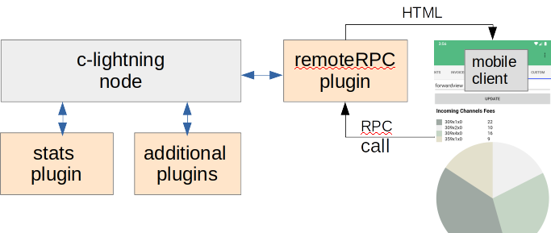
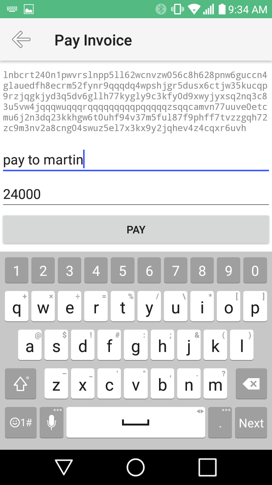
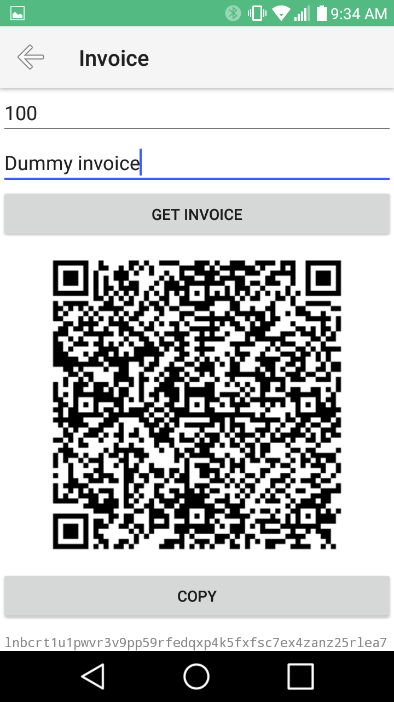

# c-lightning Mobile Client

A mobile android[[1]](#f1) app to control your c-lightning node.  This is not a mobile wallet, it is a remote client that abstracts features such as creating invoices, sending payments etc., 
all wallet functionality is in your node. This app also provides full RPC access for power users.

In [Taxonomy of LN nodes](https://youtu.be/CyieujRFk3g?t=3775), Lisa Neigut defines the 3 types of lightning nodes, consumer, vendor and liquidity provider.  There are many options for consumers, this project does not aim to be a consumer product but to provide an alternative for vendors and liquidity providers

There were several motivations for creating this.  I wanted more of a power user app for my own purpose.  

I also wanted a proof of concept fot the [remoteRPC](https://github.com/rsbondi/clightning-go-plugin/tree/master/remoteRPC)
plugin as it just feels more integrated than having a seperate server to set up, install and launch, running its own protocol, where the plugin uses existing c-lightning JSON-RPC protocol and you just configure additional parameters for your existing c-lightning and let it automatically launch.  I feel the plugin could open new doors for other developers as well.

Finally, I wanted to showcase how awsome the c-lightning plugin architecture is and create an example app that would take advantage of this as shown in the `Cusom screens` section below.

## Warning: #reckless

only use for testnet/regtest or with small amounts of funds, feedback, issues, pull requests always welcome. 

## Requirements

a [c-lightning](https://github.com/ElementsProject/lightning) node with 
[remoteRPC](https://github.com/rsbondi/clightning-go-plugin/tree/master/remoteRPC)
plugin

You will also need a registered domain name and a valid certificate from a recognized authority  ex. [letsencrypt](https://letsencrypt.org/) (*you may be able to use a self signed but I had no luck getting the mobile device to accept*).

## Install

1. Set up c-lightning from above link
1. Install certificate on same machine
1. Build the plugin from above link or use [linux-x64 binary](https://moonbreeze.richardbondi.net/remote_plugin)
1. Configure c-lightning to use the plugin in the appropriate config file or add options to the command line and point to the installed certificate.
1. Install mobile app on mobile device for [apk](https://moonbreeze.richardbondi.net/clightningclient-0.0.7.apk) or clone repo and run

feel free to DM me on [twitter](https://twitter.com/r_bondi) if you need help

## Usage

When app is launched for the first time, you will taken to the settings screen.
Enter the requested informaition, `remoteUrl` to match your secured domain, including port, `remoteUser` and `remotePassword` to match those used for the `remoteRPC` plugin.
The `appPassword` is the local password to unlock the app.

Currently there is some basic payment, connection and invoice information.

## RPC access

This client gives you full access to all the RPC calls from the `RPC` tab.  The plugin architecture of c-lightning allows for RPC passthrough, so in other words a plugin can add additional RPC commands.  Since communication is through the `remoteRPC` plugin, which is just a proxy to the unix socket connection to c-lightning, any RPC command added via a plugin would also be available.

The RPC screen internally calls the `help` RPC command to build a list of available commands which can be selected from a list making it a bit easier to use.

## Custom screens - WIP

Custom screens can be displayed by enabling the `Show Custom Tab` option in the setting screen

The above diagram shows the basic layout of the mobile client data flow.  All calls go through the `remoteRPC` plugin.  The plugin is the basic communication between the client and your node, normally using JSON RPC internally to provide data for all screens.  With the custom setup, the JSON RPC `result` field contains the HTML of the data to be displayed.  This gives you flexibility of being able to display info about your node in a way that best suits your needs.  You just need a plugin that creates an HTML result.  See the [example](https://github.com/rsbondi/clightning-go-plugin/tree/master/stats) that I created, it is in go, but plugins can be any language, python has wide support.  See [go](https://github.com/niftynei/glightning) and [python](https://github.com/ElementsProject/lightning/tree/master/contrib/pylightning#writing-a-plugin) libraries for ease of plugin development.

To use custom screens, when on the custom tab you will get a new menu command `Toggle Custom Edit`.  This will show a text field to enter custom command.  Enter the command and press `Update` button.  If all looks well, press the `Save` button.  When the tab launches, the first saved command will execute.  If there are more than one saved, you will get an additional menu commmand, `Select Custom Command`.  This will allow you to choose a different display for this tab.

See [video](https://www.youtube.com/watch?v=KF3fvi0j8b8)

## To be implemented
* Chain funds? (withdraw, newaddress)

## Other options

[spark wallet](https://github.com/shesek/spark-wallet)

[c-simple](https://github.com/darosior/c-simple)

## Screenshots

|Make Payment|Create Invoice|
|-------|----------|
|||

|Payment Detail|Hard Core|
|-------|----------|
|||

[more](./screenshots)

1.  *This is written in nativescript and should be easily adaptable for ios, I have no interest in Apple products and their authoritarian policies exclude me from working on it*
