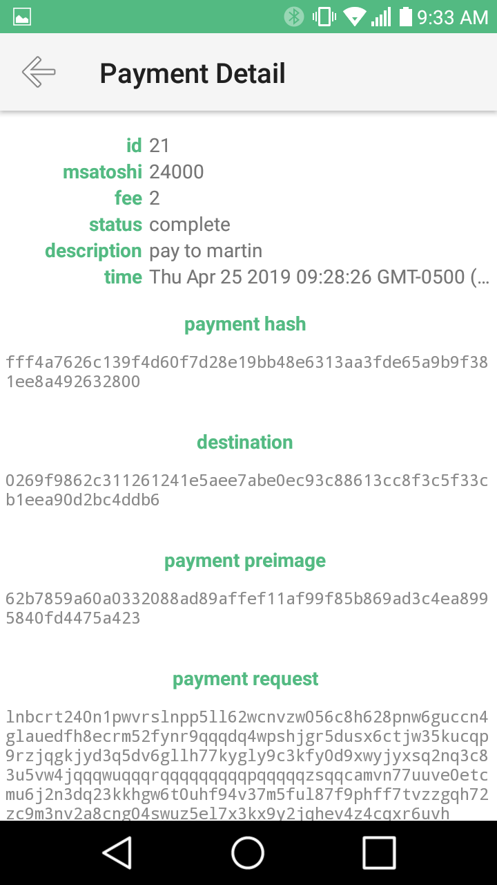
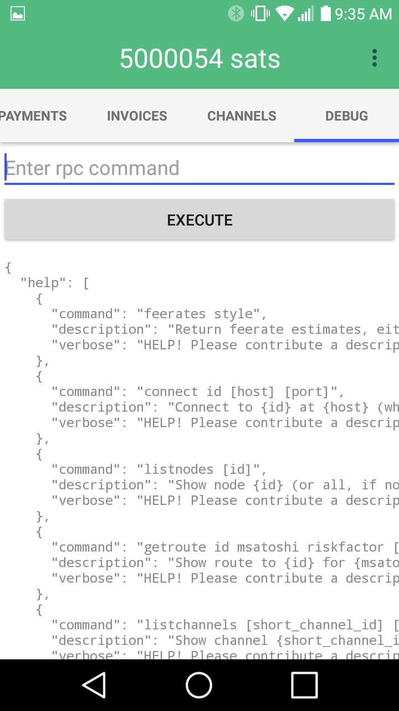

# c-lightning Mobile Client

A mobile android[[1]](#f1) app to control your c-lightning node.  This is not a mobile wallet, it is a remote client that abstracts features such as creating invoices, sending payments etc., 
all wallet functionality is in your node. This app also provides full RPC access for power users.

There were several motivations for creating this.  I wanted more of a power user app for my own purpose.  I also wanted a proof of concept fot the [remoteRPC](https://github.com/rsbondi/clightning-go-plugin/tree/master/remoteRPC)
plugin as it just feels more integrated than having a seperate server to set up, install and launch, running its own protocol, where the plugin uses existing c-lightning JSON-RPC protocol and you just configure additional parameters for your existing c-lightning and let it automatically launch.  I feel the plugin could open new doors for other developers as well.

## Warning: #reckless

only use for testnet/regtest or with small amounts of funds, feedback, issues, pull requests always welcome. 

## Requirements

a [c-lightning](https://github.com/ElementsProject/lightning) node with 
[remoteRPC](https://github.com/rsbondi/clightning-go-plugin/tree/master/remoteRPC)
plugin

You will also need a registered domain name and a valid certificate from a recognized authority  ex. [letsencrypt](https://letsencrypt.org/) (*you may be able to use a self signed but I had no luck getting the mobile device to accept*).

## Install

1. Set up c-lightning from above link
1. Install certificate on same machine
1. Build the plugin from above link or use [linux-x64 binary](https://moonbreeze.richardbondi.net/remote_plugin)
1. Configure c-lightning to use the plugin in the appropriate config file or add options to the command line and point to the installed certificate.
1. Install mobile app on mobile device for [apk](https://moonbreeze.richardbondi.net/clightningclient-0.0.2.apk) or clone repo and run

feel free to DM me on [twitter](https://twitter.com/r_bondi) if you need help

## Usage

When app is launched for the first time, you will taken to the settings screen.
Enter the requested informaition, `remoteUrl` to match your secured domain, including port, `remoteUser` and `remotePassword` to match those used for the `remoteRPC` plugin.
The `appPassword` is the local password to unlock the app.

Currently there is some basic payment, connection and invoice information.  Any connections must already be set from your node or from the app using the DEBUG tab which gives you full RPC access.

## To be implemented
* Channel management WIP
* Chain funds (withdraw, newaddress)
* Debug helpers

## Other options

[spark wallet](https://github.com/shesek/spark-wallet)

[c-simple](https://github.com/darosior/c-simple)

## Screenshots

|Make Payment|Create Invoice|
|-------|----------|
|||

|Payment Detail|Hard Core|
|-------|----------|
|||

[more](./screenshots)

1.  *This is written in nativescript and should be easily adaptable for ios, I have no interest in Apple products and their authoritarian policies exclude me from working on it*
